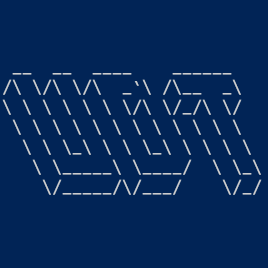

# USB Drive Thief (UDT) - 便携式USB监控系统



## 项目简介
一款基于Windows系统的后台服务程序，用于实时监控USB存储设备接入事件，自动执行预定义的文件采集操作。适用于企业数据备份、安全审计等场景，请务必在合法授权范围内使用。

## 系统要求
- Windows
- 安装需管理员权限

## 核心功能
✅ **静默后台运行**  
✅ **智能文件过滤**（正则表达式支持）  
✅ **文件大小限制**（防止大文件占用）  
✅ **多实例检测**（防止重复运行）  
✅ **权限自动提权**（UAC自动处理）  
✅ **日志跟踪**（操作记录存储于系统临时目录）

## 编译
运行build.bat即可。

## 安装与部署
### 启动
运行udt.exe即可。
### 设置为开机自启动
在manager中选择Install，或执行下面的指令：
```bash
# 以管理员权限运行
manager install
```
### 取消开机自启动
在manager中选择Uninstall，或执行下面的指令：
```bash
# 以管理员权限运行
manager.exe uninstall
```

## 使用说明
### 服务管理
在manager中执行相关指令即可

### 文件监控
1. 插入USB存储设备
2. 自动扫描符合规则的文件
3. 文件存储至 targetDir 目录
> 正在传输的文件会添加 .part 后缀
> 传输完成后自动重命名为原始文件名

## 技术实现
### 核心机制
- USB设备检测：Windows GetLogicalDrives API轮询
- 文件过滤：regexp2 正则引擎
- 全局单实例控制：C:\Windows\Temp\UDT\app.lock 锁文件
- 权限管理：AdjustTokenPrivileges 提权
- 信号处理
  - 支持以下控制信号：
  > CTRL+C (SIGINT)
  > 
  > CTRL+BREAK (SIGBREAK)
  > 
  > 系统终止信号 (SIGTERM)
## 注意事项
⚠ 法律合规：使用前必须获得设备所有者授权


⚠ 防病毒排除：需添加杀毒软件白名单


⚠ 存储路径：建议使用独立加密分区


⚠ 日志清理：定期清理 C:\Windows\Temp\UDT 目录


## 授权协议
GNU-3.0 License | Copyright © 2024 skyqvn. 保留所有权利
